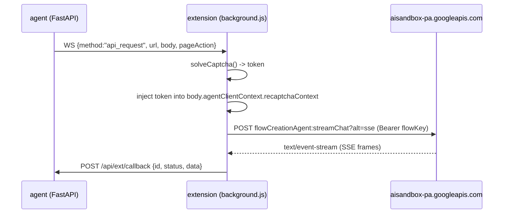

# Google Flow Creation Agent — API contract

Talking to Flow's own in-project AI agent instead of POSTing generation requests at the
image/video endpoints. On image work the agent is markedly more reliable: it rewrites prompts
itself, re-attaches the right character references, and holds continuity across shots — where
the direct API path drifted badly down a multi-step edit chain.

**This is an API, not a UI automation.** The browser scripts under `scripts/` exist only to
discover this contract. Production drives it through the extension's existing `api_request`
path — the host is already in `host_permissions`, the bearer token is already captured, and
reCAPTCHA is already solved. No DOM automation ships.

## Flow



## The request (captured verbatim 2026-08-15)

```
POST https://aisandbox-pa.googleapis.com/v1/flowCreationAgent:streamChat?alt=sse
accept: text/event-stream
authorization: Bearer <flowKey>
content-type: application/json
origin: https://labs.google
referer: https://labs.google/
```

```json
{
  "agentSessionId": "9f449340-ef81-4e57-8385-204fe49037fc",
  "agentClientContext": {
    "projectId": "projects/<PROJECT_ID>",
    "clientSessionId": ";<epoch_ms>",
    "recaptchaContext": {
      "token": "<recaptcha enterprise token>",
      "applicationType": "RECAPTCHA_APPLICATION_TYPE_WEB"
    },
    "turnNumber": 3
  },
  "userMessage": { "userPrompt": { "parts": [{ "text": "<the prompt>" }] } }
}
```

## Orchestration chain

| Field | Where it comes from | Notes |
|---|---|---|
| `agentSessionId` | generated once per conversation | Reuse across turns to keep context; a new uuid starts a fresh conversation |
| `agentClientContext.projectId` | `projects/` + Flow project id | Flow Kit project ids ARE Flow project ids |
| `clientSessionId` | `";" + Date.now()` | leading semicolon is part of the observed value |
| `recaptchaContext.token` | extension `solveCaptcha()` | already implemented for the generation endpoints |
| `turnNumber` | increments per message in the session | first turn is 1 |
| `userMessage.userPrompt.parts[0].text` | the prompt | plain text |

## Gotchas

- **`agentClientContext`, NOT `clientContext`.** The extension's captcha injection originally
  only handled `clientContext.recaptchaContext` and `requests[].clientContext`, so the token
  was silently never injected for this endpoint and the call would fail exactly as though the
  captcha had not been solved. Fixed in `background.js`; keep the branch when refactoring.
- **`alt=sse` returns `text/event-stream`.** `handleApiRequest` does `response.text()` with a
  JSON-parse fallback, so the whole stream arrives as raw text — parse SSE frames agent-side.
  It is not incremental; the promise settles when the stream closes, which for a generation
  turn can be minutes.
- **The agent generates asynchronously.** The SSE turn returning does not mean the images
  exist yet; poll the project media rather than trusting the response.
- **Flow's `/edit/<uuid>` permalinks are a different id space from `media_id`.** To bring an
  agent-produced image back into the pipeline, download the pixels and re-upload via
  `/api/flow/upload-image`. Flow's internal ids do not travel.
- Prompt hygiene that mattered: ask for the **full face to stay visible** (a cropped face in a
  start frame makes the video model invent the missing half), and explicitly forbid props that
  read as weapons when the character canonically carries one.

## Discovery scripts (dev only, never prod)

| Script | Role |
|---|---|
| `scripts/flow-login.mjs` | one-time human Google login into a persistent Patchright profile |
| `scripts/flow-agent-probe.mjs` | read-only: dumps the a11y tree, pulls finished images out |
| `scripts/flow-agent-send.mjs` | sends one message; captures this contract to `captures/` |

Auth note: a cookie export scoped to `labs.google` authenticates **reads only** — the app
renders as signed in and the first write bounces to `signin?error=Callback`. Flow re-validates
against Google OAuth (`scope=auth/aisandbox`), so the `google.com` cookie set is required,
which no labs.google-scoped export can contain. Hence the one-time human login. Vanilla
Playwright is refused by Google sign-in; Patchright + real Chrome is what works.
